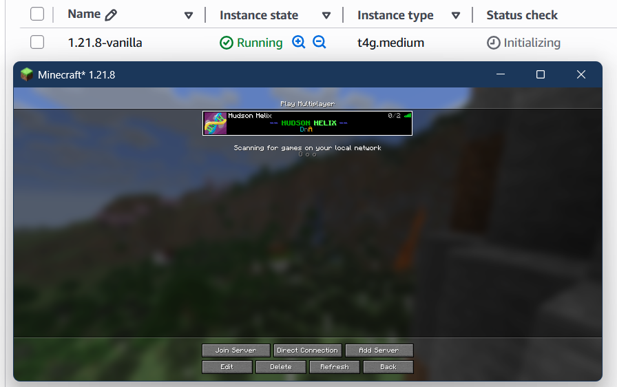
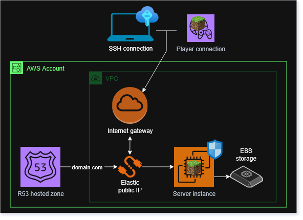

# tf-minecraft-server
Reference this terraform module to deploy a cost-optimized, configurable Minecraft server on AWS EC2.
Optionally sets up a Route53 subdomain (e.g., mc.domain.com) and SSH access for maintenance.



To reference this module from a `*.tf` file, specify the source
```
source = "git::https://github.com/ruyda/tf-minecraft-server.git"
```

An example of a module with all inputs specified
```
module "tf-minecraft-server" {
  source                    = "git::https://github.com/ruyda/tf-minecraft-server.git"
  server_name               = "tf-cloud-minecraft"
  existing_vpc_id           = "vpc-1a1a6f6f3838b4b4e"
  existing_public_subnet_id = "subnet-2a2a6f6f3838b4b4e"
  availability_zone         = "us-east-2"
  domain_zone_id            = "Z8888EVEVEMQMQMBOBOB"
  domain                    = "mc.domain.com"
  ec2_instance_class        = "t4g.medium"
  ssh_keypair_name          = "tf-cloud-minecraft-keypair"
  ssh_ip_whitelist          = [ "127.0.0.1/32" ]
  player_ip_whitelist       = [ "127.0.0.1/32" ]
  minecraft_server_jar_url  = "https://piston-data.mojang.com/v1/objects/95495a7f485eedd84ce928cef5e223b757d2f764/server.jar"
  server_max_memory         = "2800M"
  server_initial_memory     = "2800M"
}
```

### Deployed resources


### Design goals

- Privacy; least permission; security
- "One click" server start/stop
- Use any downloadable server JAR file
- Static IP associable with a Route 53 registered domain

### Module inputs

| Name                          | Description                                                                                                                                  |
|-------------------------------|----------------------------------------------------------------------------------------------------------------------------------------------|
| **server_name**               | The name to assign to deployed resources                                                                                                     |
| **availability_zone**         | The availability zone of the existing or newly created private subnet                                                                        |
| **existing_vpc_id**           | (optional) The ID of an existing VPC to associate the server instance with; if null, a VPC is created                                        |
| **existing_public_subnet_id** | (optional) The ID of an existing public VPC subnet to run the server instance in; required if `existing_vpc_id` is provided                  |
| **domain_zone_id**            | (optional) A Route 53 hosted zone ID to manage routing traffic to the server                                                                 |
| **domain**                    | (optional) A Route 53 registered domain to use as a server URL; example: `mc.domain.com`; required if `domain_zone_id` is provided           |
| **ec2_instance_class**        | (optional) The instance class to assign the EC2 instance running the server; `default = t4g.small`                                           |
| **ssh_keypair_name**          | (optional) The name of the EC2 keypair to associate with the instance; required to enable SSH connections                                    |
| **ssh_ip_whitelist**          | (optional) The list of user IP CIDRs to enable SSH (:22) access to the server EC2 instance; requires a value provided for `ssh-keypair_name` |
| **player_ip_whitelist**       | (optional) The list of player IP CIDRs to enable Minecraft connection to the server; if left empty anyone can connect from Minecraft         |
| **minecraft_server_jar_url**  | (optional) The URL where your Minecraft server JAR file can be downloaded; `default = <1.28.10.server.jar URL>`                              |
| **server_max_memory**         | (optional) The value passed to `-Xmx` flag when starting server.jar; cannot exceed the EC2 instance class memory; `default = 1300M`          |
| **server_initial_memory**     | (optional) The value passed to `-Xms` flag when starting server.jar; cannot exceed the EC2 instance class memory; `default = 1300M`          |


### Module outputs

| Name                   | Description                                                     |
|------------------------|-----------------------------------------------------------------|
| **server_url**         | The public IP or domain used to connect to the Minecraft server |
| **server_instance_id** | ID of the EC2 instance running the server                       |


### Usage notes

#### Starting and stopping the server
The server is started automatically when the instance is started. AWS CLI can be used to start and stop the server.
- `aws ec2 start-instances --instance-ids <<outputs.server_instance_id>>`
- `aws ec2 stop-instances --instance-ids <<outputs.server_instance_id>>`

#### SSH connections
To enable SSH connections, an EC2 keypair must exist in the deployment account. Pass the name of this keypair to `ssh_keypair_name` and connect from your SSH client using the existing `.pem` file associated with your keypair.


#### Cost analysis

This module provisions a static elastic public IP for the server which creates a cost whether the server is running or not. A zero-dollar server demands the sacrifice of a static elastic IP and letting the EC2 instance associate a random IP each time its started.

The main cost contributor is the EC2 instance class. The free tier offers compute that will suffice for low performance vanilla gameplay, but a more performant class is necessary for lag-free gameplay with many players. 

| Rating                         | Instance class  | Description                                                                      |
|--------------------------------|-----------------|----------------------------------------------------------------------------------|
| Free, tolerable performance    | **t4g.small**   | Eligible for free tier under 750 hours per month; less than 10 users recommended |
| No lag with many connections   | **t4g.medium**  | ~ $0.049 / hour of uptime; handles typical multiplayer gameplay load             |
| What have you tried?           | _ _ _ _ _ _ _ _ | Please share your usage costs if you customize your server's instance class!     |


### Issues
Use the GitHub Issues feature to report issues and discuss usage of this module.

### License
GPL2 - keep it open source.

Licensed under the GNU General Public License Version 2.0 (or later); you may not use this work except in compliance with the License. You may obtain a copy of the License in the LICENSE file, or at:

https://www.gnu.org/licenses/old-licenses/gpl-2.0.txt
